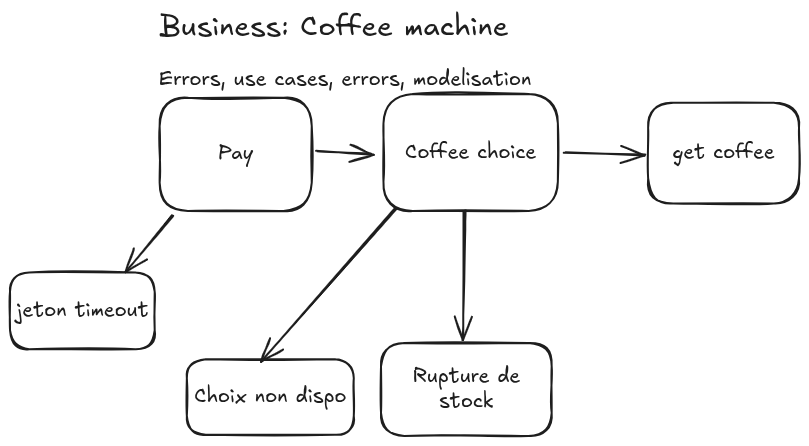

# ☕ Coffee Machine System

A modular and extensible simulation of a coffee vending machine, where users can **pay**, **select a beverage**, and **retrieve their coffee**.

## Preview

<p align="center" style="margin-top: 20px; margin-bottom: 50px;">
  
</p>

> [!IMPORTANT]
> **Coffee Machine System** is currently under development and is **not ready for production**. Expect breaking changes and incomplete features.

## Use Cases

This system models the core use cases of a physical coffee vending machine:

1. **Pay for Coffee** – Insert a token or use digital payment.
2. **Select a Coffee** – Choose from a list of available coffee options.
3. **Receive Coffee** – Dispense the selected beverage if available.

## Functional Flow

```text
Pay → Coffee Choice → Get Coffee
```

## Actions & Features

- **Payment Handling**

  - Accept token or digital payments.
  - Timeout logic if the user delays selection.

- **Coffee Selection**

  - Dynamic availability based on internal inventory.
  - Rejects invalid or unavailable choices.

- **Coffee Dispensing**

  - Delivers coffee when payment and selection are valid.
  - Updates inventory in real time.

- **Error-Driven Feedback**

  - Informs users of any issue (e.g., timeout, unavailable choice, out of stock).

## Error Handling & Exceptions

| Exception Name                | Description                                                                        |
| ----------------------------- | ---------------------------------------------------------------------------------- |
| `JetonTimeoutException`       | Triggered when payment is made but coffee selection is delayed beyond a threshold. |
| `ChoiceNotAvailableException` | Thrown if a user selects a coffee that is currently unavailable.                   |
| `OutOfStockException`         | Raised when the selected coffee is out of stock.                                   |

## Object-Oriented Design

### Main Components

- `PaymentProcessor`

  - Verifies and validates payment tokens or digital input.
  - Triggers timeout if no action is taken.

- `CoffeeSelector`

  - Displays available coffees.
  - Handles input validation and availability checks.

- `CoffeeDispenser`

  - Handles physical dispensing logic.
  - Updates inventory and confirms delivery.

- `ExceptionHandler`

  - Catches and handles known exceptions.
  - Logs or returns meaningful messages to the system or user interface.

## Contributing

Not receiving contribution. Build your own coffee machine!
